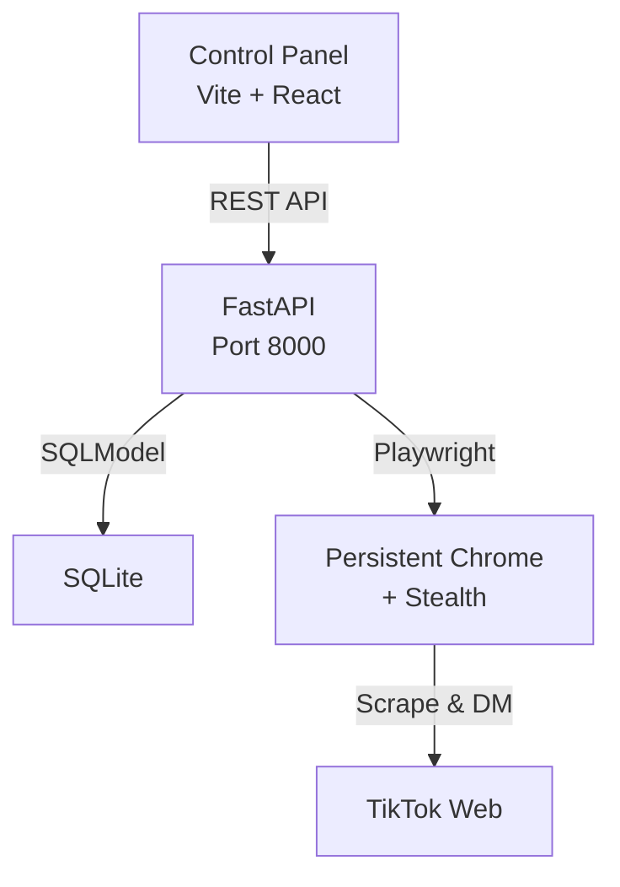

# 🚀 StudioLink Outreach Engine

[](https://python.org)
[](https://fastapi.tiangolo.com)
[](https://react.dev)
[](https://playwright.dev)
[](LICENSE)

**Automatización de prospección en TikTok con identidad dual (Bailarín + Programador).**

Un sistema de outreach asistido que combina automatización inteligente con el toque humano para contactar dueños de academias de forma masiva pero artesanal.

> **⚠️ Disclaimer**: Esta herramienta es para uso educativo y de prospección legítima. Úsala responsablemente y respeta los Términos de Servicio de TikTok.

---

## ✨ Features

- **🎯 Lead Management** — CRM completo con filtros por nicho y estatus
- **✍️ Spintax Templates** — Copys con variaciones automáticas para mensajes únicos
- **🔥 Warming Pipeline** — Visitas de perfil + likes tácticos antes del DM
- **⌨️ Keystroke Dynamics** — Simulación de escritura humana (50-180ms por tecla)
- **🛡️ Anti-Ban Protocols** — Gaussian jitter, throttling, blacklist, no-headless
- **👤 Human-in-the-Loop** — Aprobación manual antes de cada envío
- **📡 Live Activity Log** — Consola en tiempo real con Server-Sent Events
- **🚀 Dispatch Center** — Control de jobs con Play/Pause y countdown timer

## 🏗️ Architecture



## 📦 Quick Start

### Prerequisites

- Python 3.11+
- Node.js 18+
- Google Chrome installed

### 1. Clone

```bash
git clone https://github.com/fercreek/Outreach-Engine.git
cd Outreach-Engine
```

### 2. Backend

```bash
cd backend
python3 -m venv .venv
source .venv/bin/activate        # macOS/Linux
# .venv\Scripts\activate         # Windows

pip install -e ".[dev]"
playwright install chromium

# Configure (optional)
cp .env.example .env

# Run
uvicorn app.main:app --host 0.0.0.0 --port 8000
```

The API will be at `http://localhost:8000` with auto-docs at `/docs`.

### 3. Frontend

```bash
cd frontend
npm install
npm run dev
```

The control panel opens at `http://localhost:5173`.

## 📁 Project Structure

```
outreach-engine/
├── backend/
│   ├── app/
│   │   ├── main.py              # FastAPI app + template seeding
│   │   ├── config.py            # Safety limits & settings
│   │   ├── database.py          # SQLite engine
│   │   ├── models.py            # 5 SQLModel tables
│   │   ├── schemas.py           # Pydantic DTOs
│   │   ├── routers/
│   │   │   ├── dashboard.py     # Stats aggregation
│   │   │   ├── leads.py         # CRUD + bulk import
│   │   │   ├── templates.py     # Spintax management
│   │   │   ├── jobs.py          # Job lifecycle
│   │   │   ├── logs.py          # SSE streaming
│   │   │   └── blacklist.py     # Exclusion list
│   │   ├── services/
│   │   │   ├── browser.py       # Playwright + stealth
│   │   │   ├── discovery.py     # TikTok scraping
│   │   │   ├── warming.py       # Profile visits + likes
│   │   │   ├── outreach.py      # DM with keystroke dynamics
│   │   │   ├── monitor.py       # Reply detection
│   │   │   └── spintax.py       # Template variations
│   │   └── utils/
│   │       └── jitter.py        # Gaussian delays
│   └── pyproject.toml
├── frontend/
│   ├── src/
│   │   ├── App.jsx
│   │   ├── index.css            # Design system
│   │   ├── api/client.js        # API client
│   │   ├── pages/               # 6 pages
│   │   └── components/          # Sidebar, Toast, Badge
│   └── package.json
├── LICENSE
└── README.md
```

## 🛡️ Safety Protocols

| Protocol | Value | Purpose |
|----------|-------|---------|
| DM Throttle | 15-20 min | Tiempo entre mensajes |
| Daily Cap | 45 DMs | Límite diario |
| Gaussian Jitter | 45-90s | Delays con distribución normal |
| Keystroke Delay | 50-180ms | Simulación de escritura humana |
| Browser Mode | Visible | Sin headless para evitar detección |
| Blacklist | Enforced | No contactar cuentas excluidas |

## 🤝 Contributing

1. Fork the repo
2. Create a feature branch (`git checkout -b feature/amazing-feature`)
3. Commit your changes (`git commit -m 'Add amazing feature'`)
4. Push to the branch (`git push origin feature/amazing-feature`)
5. Open a Pull Request

## 📄 License

[MIT](LICENSE) — Fernando Contreras © 2026
